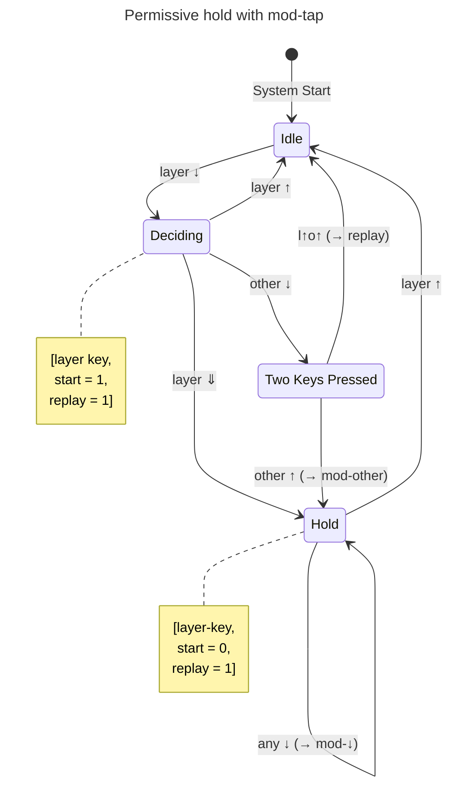

# 🛠️ Developer documentation

This is the documentation file for developers.

## Dev environment setup

This section describes how to setup your development environment.

1. Install Lefthook:

    ```shell
    lefthook install
    ```

1. Initialize NPM:

    ```shell
    npm install
    ```

## Implementation

This diagram describes the high-level state transitions for a
permissive hold manipulator within a mod-tap layer.


